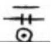
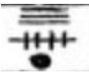
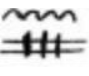

# **Beyond the veil: cosmic horror roleplaying**

## **Disclaimer**

The rules of **Beyond the veil: cosmic horror roleplaying** are heavily inspired by [Elish](https://www.elish.it/it/cose-elish), 
_Vampire: The Masquerade_, and the works of _H.P. Lovecraft_, among other sources. 
The intent is not to create an entirely new system but to merge various mechanics 
into a **simple, flexible ruleset where narration is the primary focus**.

This is not a comprehensive game manual, but rather a pamphlet that provides 
the foundational rules you can use to create your own campaign. 
I have used this guide to master several campaigns over the last two decades, 
and friends and fellow gamers have often asked me to share it online. 
I am not sure this can have any usefulness to anyone, but anyway here it is 😃

Here, I present a **Lovecraftian-flavored adaptation**, 
designed for cosmic horror, investigation, and survival against the unknown.

Due to the **flexible nature of the rules**, **Beyond the Veil** can be 
easily adapted to **any setting**. Whether used for fantasy, science fiction, 
cyberpunk, or historical campaigns, the system’s core philosophy remains 
the same: **the story is more important than the rules**. 
Mechanics exist to **enhance the narrative**, not restrict it, 
allowing for immersive, cinematic, and dynamic storytelling.

## **Preface: the essence of narration in roleplaying**

Role Playing games are a unique form of storytelling where players create
and experience a shared narrative. Unlike traditional storytelling, 
where an author controls the flow of events, a roleplaying game is 
a collaborative effort between the game master and the players. 
Each player embodies a character with their own thoughts, emotions, 
and motivations, while the game master shapes the world, its dangers, 
and its mysteries. Together, they weave an unpredictable and immersive story, 
dictated as much by player choices as by the cruel hand of fate.

Beyond the Veil is a game of mystery, tension, and dread. 
It is not about heroism or glory but about survival, discovery, 
and the overwhelming insignificance of humanity in the face of cosmic horrors. 
The unknown lurks at the edges of reality, and knowledge itself is dangerous. 
Characters will struggle, not only against physical threats but also against 
their own limitations—both mental and spiritual.

### **The role of players in storytelling**

Unlike traditional games where players wait for their turn to act, 
Beyond the Veil is an active and immersive experience. 
Players are not passive participants; they must describe their character’s actions in detail, 
making clear not only what they do but also how and why they do it.

This means that every choice should be expressed in a descriptive way:

- Instead of saying _“I attack the cultist,”_ the player should describe: _“I feint a lunge to the left, trying to make him expose his side, then twist my wrist and strike for his ribs.”_
- Instead of saying _“I cast a spell,”_ the player should narrate: _“I kneel, drawing ancient symbols in the dirt, whispering the forgotten words while focusing all my will on the energy surrounding me.”_

This approach makes every action feel more real and cinematic. 
The better a player describes their actions, the more effectively 
the game master can determine the outcome.

In combat, exploration, or even social interactions, players must not only 
state their intentions but also express their character’s inner thoughts and fears. 
This enhances immersion and reinforces the horror atmosphere.

- _“I hesitate before opening the book, my fingers trembling. The glyphs on its cover seem to shift under my gaze, but it must be my imagination… I have to know what’s inside.”_
- _“I grit my teeth, forcing my breathing to slow. The thing in the shadows hasn’t seen me yet. If I move carefully, I might slip away before it notices…”_

A roleplaying game is not just about what happens—it’s about how it happens 
and how the characters experience it.

### **Real-time combat and fluid action**

Combat in Beyond the Veil is **not** turn-based. It does not follow a strict 
sequence of rounds where players act one by one. Instead, the flow of battle 
is dictated by **real-time descriptions and decisions**, overseen by the game master.

- Players must **describe exactly how they fight**, rather than just rolling dice. The game master will judge how the battle evolves based on these descriptions, the environment, and other factors.
- Timing, positioning, and tactics matter. A player who waits for the right moment to strike or sets a trap may gain an advantage, while reckless actions can lead to disaster.
- The game master may interrupt or modify actions based on the flow of battle. If a player hesitates too long or an enemy reacts faster than expected, things can change in an instant.
- **Combat is a living, evolving scene**, where every participant influences the outcome dynamically. A fight is not just a sequence of rolls—it is a chaotic, unpredictable clash where survival depends on intelligence, skill, and instinct.

A fight might unfold like this:

1. A player describes how they prepare, gripping their weapon and analyzing their opponent’s stance.
2. The enemy suddenly lunges, and the player must react—do they dodge, block, or counterattack?
3. The game master determines whether the attack lands, and if so, how much damage it inflicts.
4. The player might try a risky maneuver, like stepping onto unstable ground for better reach, or throwing sand in the opponent’s eyes. The Game Master judges the likelihood of success based on the description.

Combat is not just about numbers—it’s about how the fight unfolds in the story. 
The best fighters are not those with the highest stats, but those who think and act creatively.

### **The game master’s role: the unseen hand of fate**

The game master is not an enemy or an opponent. The game master is the guide, the world, the hidden forces shaping reality. Her/his role is not to "beat" the players but to challenge them, to provide a world filled with mystery, danger, and choices that have real consequences. The game master:

- describes the environment in vivid detail, setting the atmosphere and foreshadowing horrors to come.
- determines how events unfold based on player actions, improvising and adapting as needed.
- enforces the consequences of actions—both good and bad. A hasty decision can be fatal, but a well-planned maneuver can turn the tide of battle.
- keeps the tension alive, using subtle clues, unsettling descriptions, and unexpected twists to create a sense of dread.

Most importantly, the game master should encourage storytelling. Players should be rewarded for detailed descriptions and clever tactics, while mindless or repetitive actions should have diminishing effectiveness.

It is essential that the game master **does not force a narrative**. Instead, the game master should provide a **non-linear plot** that is **dynamic**, allowing the story to evolve naturally based on the players' decisions, actions, and intentions. The game master should react to the choices made by the players, ensuring that their actions have meaningful consequences and that the game world feels responsive and alive.

By focusing on **flexibility** and **player agency**, the game master helps create an immersive and engaging experience where the direction of the game is guided by **collaboration** and **interaction** rather than a fixed storyline. This encourages the players to take risks, explore different paths, and contribute to the world in a way that makes the story uniquely their own.

### **A world of horror, mastery, and consequences**

Beyond the Veil is not a game where characters become unstoppable warriors. Every wound weakens them, every moment of hesitation could mean death, and every secret learned carries a price. This is a game where knowledge is dangerous, power comes at a cost, and the universe is vast, terrifying, and indifferent to human existence.

The world does not exist for the players to "win"—it exists for them to **survive, uncover, and endure**. Every encounter should feel dangerous, every mystery should feel forbidden, and every moment of success should come with the fear of what happens next.

The rules exist not to limit storytelling but to enhance it, providing a framework for action and consequence. Ultimately, the story is in the hands of the players and the game master, and together, they create a tale of horror, struggle, and the unknown.

The only certainty is this: the deeper you go, the darker it gets.

# **Character sheet**
Character sheet template link: [Character Sheet](https://docs.google.com/document/d/1cT09dZTze4uYA186N-TN0P2jmEwkjoKCN7Hpp53xlUc/edit?usp=sharing)
In this section, I will primarily address the rules regarding statistics. However, the most important aspect of creating a character is defining their background, personality, and physical and psychological traits.
By starting with a well-developed characterization, the choice of skills will naturally follow.

## **Characteristics**
**Body, Spirit, and Mind** have a maximum value of **120**. For humans:

- **50** is the average value for a normal human.
- **80** is the maximum natural limit for humans.
  
Of course, special in-game events can change these limits.

**Characteristics values** are determined by the **Attributes** (see below).

## **Attributes**

Attributes define a character's fundamental abilities in three main categories:

- **Body:** Strength, Agility, Constitution, Reaction
- **Spirit:** Edge, Magic, Essence, Corruption
- **Mind:** Logic, Willpower, Intuition, Charisma

Each attribute has an absolute **maximum value of 5**, with the **default value set at 1**. **A value of 4** is the maximum natural limit for humans. Of course, special in-game events can change these limits.

### **Attribute levels**

For each attribute, there are specific **level descriptions**:
**Example for Strength:**

- **1:** No muscle (e.g., someone who has never worked out)
- **2:** Amateur level (e.g., consistent training, but not professional)
- **3:** Professional level (e.g., boxer, bodybuilder, etc.)
- **4:** Champion level (e.g., top 5% among professionals, national or international winner)
- **5:** Ancient level (e.g., unparalleled in the field, mythic strength)

### **Attributes at character creation**

At creation, **karma points** are spent to raise attributes from their **default value of 1**. The cost to increase an attribute is as follows:

- 1 **karma point** to raise an attribute of 1 level (i.e., to go from 1 to 2 costs **1 karma point**, as well to go from 2 to 3).
- The **initial maximum value** for any attribute at character creation is **3**.
- **Only one** attribute (highlight it in bold in the character sheet) can be set to **4** by spending **1 additional karma point** (i.e., to go from 3 to 4 costs **2 karma points**).

The initial available karma points to spend on attributes are:

- **7 points** for the **primary characteristic**
- **5 points** for the **secondary characteristic**
- **3 points** for the **tertiary characteristic**

To determine a **characteristic value** from the attributes, use this formula:

**SUM of points in attributes under a characteristic class × 5 \+ 20**

**Example:** If a character has **Strength \= 4**, **Constitution \= 3**, **Reaction \= 2**, and **Agility \= 1**, the Body characteristic will be:
**(4 \+ 3 \+ 2\ + 1\) × 5 \+ 20 \= 70**

### **Permanent attribute loss**

If a permanent loss occurs in an attribute (e.g., losing 1 point of Agility due to the loss of a hand), this also lowers the corresponding **characteristic** by 5 points.

## **Skills**

**Skill levels** range from **0 (untrained) to 10**.

- The **maximum skill value** for human is **7**.
- The **default value** is **0**, which represents an untrained skill.
- The initial maximum skill value at character creation is **3**.
- 1 **karma point** to raise a skill of 1 level (i.e., to go from 1 to 2 costs **1 karma point**, as well to go from 2 to 3).
- At creation, **only** one skill (highlight it in bold in the character sheet) can be set to **4** by spending **2 more karma points** (i.e., raising from **3 to 4** costs **3 karma points**). This selected skill can raise past the human limit of level 8.

Of course, special in-game events can change these limits.

The number of karma points available at creation to spend on skills is determined by the following formula:

**(SUM of Logic, Willpower, Intuition values) × 2 \+ 10**

**Example skill progression (knowledge in science):**

- **1:** High School knowledge
- **2:** Bachelor's degree
- **3:** Master's degree
- **4:** PhD
- **5:** Researcher
- **6:** Senior Researcher
- **7:** Nobel Prize winner
- **8:** Genius-level expertise
- **9–10:** Ancient-level mastery

Skills are listed on the character sheet as a starting point, providing a basic framework for the character’s capabilities. 
This list serves as a **guideline** rather than a strict limitation. Both the game master and player have the flexibility 
to **add**, **modify**, or **expand** the skill set to better suit the character's background, role in the story, or specific needs in the game.

The game emphasizes **narrative flexibility**, meaning the skills a character can possess are not bound to a predefined list. The GM and player can work together to create new skills or adapt existing ones to reflect the evolving needs of the story or the player’s vision for their character. This fosters a more **personalized** and **immersive** experience.

Key Points:

- **Starting Point**: The listed skills on the character sheet are simply suggestions and examples. They offer a foundation for the player to begin with, but they are not exhaustive.
- **Collaboration**: The game master and player are encouraged to collaborate when considering new skills. This could include skills that are unique to the setting, character backstory, or gameplay mechanics.
- **Customization**: If the player wants to have a skill not on the list or modify an existing one (e.g., combining skills, changing the focus of a skill, or creating an entirely new skill), it can be added or modified with GM approval.
- **Narrative Focus**: Skills are tools for **narrative** expression, helping players describe how their characters interact with the world. If a character uses a skill in a way that is not covered by the traditional lists, it can still be valid as long as it makes sense within the context of the story and is agreed upon by the GM and player.
- **Examples of Adjustments**:
  - A **historian** might have a knowledge skill for **ancient languages** that is specific to their backstory, even if it's not on the list.
  - A **pirate** character might possess **swashbuckling** as a combat style skill, modifying the general **close combat** skill to better fit their character.

By allowing such freedom, the game becomes more about **storytelling**, where skills are not just mechanical features but tools to enrich the character's journey and interaction with the world.

### **Skill rolls**

The system is designed to allow for both narrative-driven character growth and a balanced approach to mechanical progression.

When a skill is at **0** (untrained), the character suffers a **-3 penalty** to the roll. Untrained skills are inherently more difficult to perform, and penalties can escalate to **-10** depending on the context, such as extreme complexity, stress, or environmental hindrances.

**Skill checks** are rolled using:  
**d20 + Attribute + Skill Level**

For example, if a player attempts to perform lockpicking with the skill **Manuality** (at level 0), they would roll a **d20**, add their **Agility** modifier (if relevant), and subtract **3** for being untrained. This makes success more difficult, but not impossible. However, if the situation is particularly challenging (e.g., an ancient, enchanted lock in a rainstorm), the penalty could be even higher, such as **-10**.

On the other hand, it is crucial for the Game Master to keep track of players' skill values. A high-level skill indicates exceptional proficiency, meaning that for simple actions, the character may not need to roll at all, or the difficulty should be significantly lower.

Additionally, many skills are best handled as passive rolls by the Game Master. For instance, a player may not explicitly declare that they are on high alert, yet the Game Master can still roll for passive perception or sixth sense to determine if the character hears someone approaching. Similarly, an empathy roll could be made to assess whether an NPC is lying, enhancing immersion and realism in gameplay.

### The importance of specificity in skill rolls

The more **specific** a player’s description of their action, the more likely they are to succeed. This reflects a key aspect of the game: **narrative detail influences outcomes**. For instance:

- **General action:** _“I search the room for clues.”_  
  This vague description makes it harder for the GM to determine exactly what the character is focusing on, leading to a more challenging roll.
  
- **Specific action:** _“I carefully examine the desk drawers, looking for any papers that might reveal a hidden motive.”_  
  The specificity of the action gives the GM clear criteria to judge success, making the skill roll easier and more rewarding.

By focusing on the **specifics** of an action, such as carefully analyzing an object or searching in a particular way, a player helps the GM assess the outcome more clearly, often reducing penalties or enhancing the chances of success. This encourages detailed, immersive roleplaying and dynamic problem-solving, which are core to the experience of this rule-set.

### **Edge: rerolling skills**

A character with a high **Edge** is exceptionally lucky, and this manifests in the game mechanics as the ability to **reroll** skill checks. Here’s how it works:

1. First, roll **d20 \+ Attribute \+ Skill** as usual for a skill check.
2. If the player wants to reroll, they may use their **Edge** \+ the **Skill Level** from the original roll as the new modifier for the reroll.
3. After the reroll, the higher of the two results (the original or the rerolled) is used as the final outcome.

However, **luck** comes with a price. Each time a player chooses to reroll, their character suffers **at least** a **5-point damage** to their **Mind** characteristic, regardless of whether **Edge** is based on the **Spirit** characteristic. This damage represents the mental strain and focus required to manipulate fate itself.

## **“Leveling up”**

Characters can level up their **Attributes** and **Skills** over time:

- **Leveling up skills** costs **2 karma points × current skill level**.
- **Leveling up attributes** costs **4 karma points × current attribute level**.

If a skill is **level 0**, it cannot be leveled up until the character receives **training** or spends significant time learning on their own. Skills above level **6** cannot be advanced without specific in-game events or teacher guidance.

NOTE: Players and the Game Master may choose to disregard this rule.

A more realistic and immersive system would require players to train specific attributes and skills over time, with level-ups occurring only after prolonged training or exceptional in-game actions. However, in my experience over the years, this method is difficult to maintain and often restricts player choices.

Conversely, the point system should not be overused. If a player suddenly boosts a skill or attribute they have never used or trained, the Game Master should address this inconsistency.

### **Karma points for leveling up:**

The number of karma points required to level up attributes and skills is determined by:
**FLOOR(SUM of Logic, Willpower, Intuition) / 2\ \+ X**
Where **X** is a value determined by the game master for each leveling-up period.

Unspent **karma points** can be stored for future use.

## **Qualities**

**Qualities** are special benefits (e.g., resistance to poison) or drawbacks (e.g., drug dependency). This are highly linked to the character background, personality, physical and psychological traits and they help in a deeper characterization.

- **One positive quality** can be selected at the start, but for each additional positive quality, a negative quality must also be chosen.
- Players can create **custom qualities** and submit them to the game master for approval.

# **Combat rules**

- **Attack:** Roll **Agility \+ skill (e.g Marksman**) against the target’s **Agility \+ Dodge**. The difference between the results determines the **vehemence** of the attack.
  - Add the **vehemence** of the weapon.
  - Subtract the target’s **vehemence** of the armor.

The final **vehemence** value determines the **damage inflicted**, using the following conversion table.
**Note:** The **description of the action and the context** can **modify vehemence**, either increasing or decreasing the impact of an attack. **Creativity and strategy matter.**

|         Type of Damage (body)         |                  Symbol                  |  Damage  | Vehemence | Typical recovering time |
| :-----------------------------------: | :--------------------------------------: | :------: | :-------: | :---------------------: |
|            scratch bruise             |  |  1 \- 4  |  1 \- 2   |         2 days          |
|  wound contusion partial perforation  |  | 5 \- 10  |  3 \- 7   |         1 week          |
|       cut fracture perforation        |   | 11 \- 25 |  8 \- 12  |         3 weeks         |
| gash internal lesion full perforation |  | 26 \- 40 | 13 \- 16  |         6 weeks         |
|          amputation smashing          |  | 41 \- 55 | 17 \- 20  |                         |
|                mortal                 |  | 8 \- 55+ |  21 \- …  |                         |

## **Vehemence and weapon examples**

Vehemence is a measure of the force or effectiveness of an attack, influenced by the weapon used, the character’s skill, and the context of the action. The description of the attack and the narrative context can modify vehemence, either increasing or decreasing its impact based on the player’s creativity and strategy.

For instance:

- **Two-handed maul with powerful stomp**: If a character wields a two-handed maul and performs a powerful downward stomp, the **Power** skill may be added to the vehemence of the attack. This represents not just the weight of the weapon, but the sheer force, momentum, and physical strength behind the strike.
- **High-caliber firearm with piercing capabilities**: A high-caliber firearm might bypass or reduce the effectiveness of armor. Even well-armored targets (such as someone in full plate armor) could still be vulnerable to a well-placed bullet due to the piercing nature of the weapon.

## **Examples of vehemence for weapons:**

- Dagger: 2
- One-Handed Sword: 4
- Revolver: 6
- Full Plate Armor: 8

## **Strategic combat and narrative focus:**

The combination of **weapon choice**, **skills**, and **narrative context** creates dynamic, strategic combat. The **narrative description** of the attack influences its effectiveness—players can tailor their actions and use their abilities to craft the most efficient or dramatic outcomes, emphasizing creativity and tactical thinking.

This approach encourages players to be detailed in describing their combat actions, ensuring that the **narrative** always enhances the strategic elements of the game.

## **Additional considerations:**

- **Armor**: Armor impacts both the vehemence of incoming attacks and the character’s ability to dodge. For example:
  - **Full plate armor (vehemence: 8\)**: While it provides heavy protection, it can hinder a character's mobility, making them slower and less able to react to incoming attacks. Characters wearing full plate armor suffer a **malus to dodge rolls** due to the armor’s restrictive nature.
- **Combat context**: How a character describes their attack can influence its effectiveness. For example:
  - A **finesse strike** with a **dagger** aimed at a target's unprotected weak spot might result in higher vehemence or more significant damage than a wild swing.
  - **High agility with a dagger**: A character with high agility using a dagger might be able to bypass armor and attack **vulnerable points** of the opponent, such as joints or areas where armor does not cover. In this case, the character’s **finesse** and the precise execution of their strike can compensate for the weapon's lower base vehemence. The player’s **narrative** of the attack could describe how they target these vulnerable areas to increase the effectiveness of the attack.
- **Dodge rolls**: In order to roll for a **dodge**, the character must be aware of the incoming attack. This awareness can depend on various factors, such as:
  - **Perception** or **Sixth Sense** skills: A character needs to be able to sense or perceive the threat of an incoming attack to attempt a dodge. If the character is unaware of the attack or the attacker, they cannot attempt a dodge roll. Skills like **Perception** or **Sixth sense** are essential for noticing hidden or subtle threats, allowing the character to react and attempt to evade.
- For instance:
  - Character A might attempt to dodge an attack from Character B, but if Character A is unaware of where the attack is coming from—such as when they fail a **Perception** or **Sixth Sense** check—they cannot react in time to avoid it. This introduces a crucial layer of strategy: awareness of your environment and the threats within it is vital for survival. Without this awareness, even seemingly minor attacks can become devastating. For example, if a character is asleep and unaware of an intruder, the attacker could easily strike a fatal blow, like slashing the character’s throat, before they have any chance to defend themselves. Being caught off guard can result in severe consequences, reinforcing the importance of staying alert to your surroundings at all times.

## **Example of a combat scenario:**

- **Character A** has a **high-finesse dagger** and is trying to land a precise strike on **Character B**, who is wearing **full plate armor**. Since **Character A** is skilled with the dagger and targets weak spots (such as joints or unarmored areas), the player can use **Agility \+ Melee weapon roll (with a malus depending on the difficulty in reaching the weak spot and the player description)** to bypass the armor's protective effect and increase the effectiveness of the attack.
- **Character B**, in full plate armor (vehemence: 8), is trying to dodge (**Agility \+ Dodge)** or parry (**Agility \+ Melee weapon)** but suffers a **\-2 penalty** to dodge rolls due to the armor's weight. However, **Character B** may still attempt a dodge if they have the **Perception** or **Sixth Sense** skills to sense the attack.
- **Character C** has a **revolver** with **piercing capabilities** (vehemence: 6\) and aims at **Character B**, knowing that the bullet can bypass the armor's defense. If **Character B** is aware of the attack and has a high **Perception** or **Sixth Sense**, they may attempt to dodge, but if they are unaware or caught off guard, they may not get the chance to react in time. For example **Character B** may have to decide to focus the defense against **Character A or Character C.**

# **The cosmic horror, psychology and the mind:**

In the world of **Lovecraftian horror**, the mind is a fragile vessel, susceptible to the unexplainable, the unimaginable, and the utterly absurd. As characters encounter the eldritch horrors, the twisted truths, and the incomprehensible forces that defy human understanding, the events they experience can shatter their mental state. These encounters—whether they are witnessing the grotesque, being confronted by forbidden knowledge, or facing forces that defy all logic—have a profound impact on a character’s psyche, resulting in **Mind Damage**.

## **Mind damage**

When a character is exposed to something truly horrific or absurd, something beyond the reach of their comprehension, they may suffer **Mind Damage**. This damage represents the psychological strain of confronting the **Cosmic Horror**. It could be anything from staring at an incomprehensible, monstrous entity, hearing voices from the abyss, or experiencing bizarre, otherworldly phenomena that make no sense to the rational mind.

Each event that causes Mind Damage should be treated as a profound, life-altering experience. The character may need to **roleplay** the effects of their deteriorating state, embodying the psychological trauma of what they’ve witnessed. This may manifest in various ways, such as paranoia, hallucinations, nightmares, dissociation, or even a complete breakdown of their sense of reality.

## **Mind damage mechanics**

- **Mind damage** is tracked as a value, with each event reducing the total Mind score.
- When **Mind** reaches zero, the character falls into a **comatose state**, effectively dying or being lost to insanity. This represents the total collapse of the character's mental faculties after an overwhelming exposure to the incomprehensible.

  ## **Roleplaying mind damage**

Players should actively **interpret** the psychological damage inflicted on their characters. This is not just a mechanical rule but an opportunity for deep character development and immersion. For example:

- **Paranoia:** A character who has suffered significant Mind Damage might become distrustful of even their closest allies, seeing betrayal in every action and word.
- **Hallucinations:** The character may begin to see things that aren’t there—figures in the shadows, faces in the walls, or hear voices whispering forbidden knowledge.
- **Disassociation:** The character may become distant from reality, struggling to maintain their grasp on what is real and what is not. They may question if the world around them is an illusion, or if they themselves are just a figment of some greater nightmare.
- **Obsessions or Phobias:** Some characters might fixate on specific aspects of the horrors they have faced, developing irrational obsessions or phobias. A character who once feared nothing might now be terrified of the dark, or may compulsively examine every object they encounter for hidden, unnatural properties.

  ## **Dealing with mind damage**

- **Recovery:** Just as physical damage can be healed, the mind can recover. However, mental wounds are far more difficult to treat and may require specialized therapy, or even just time to come to terms with the horrors the character has experienced. If Mind is damaged, a character must engage in introspective actions or receive help from others to recover, often by making **Willpower** or **Volition** checks to confront their fears or memories.
- **Therapy and Rest:** Certain actions or environments may help reduce Mind Damage. Therapy, rest, or even spiritual guidance may be ways to heal or reduce the damage, but nothing short of extraordinary efforts will repair the deepest scars of the mind.

In conclusion, the **Mind** is an essential attribute in your character's survival, not just physically, but psychologically. The horrors they face are not merely external threats; they are the harbingers of internal destruction. The deeper the characters dive into the mysteries of the universe, the more they must guard their sanity—because even a single glance at the abyss can push them beyond the brink.

# **Magic in the world of cosmic horror**

In the world of Lovecraftian horror, **magic** is not the fantastical tool of heroes but a dangerous and unpredictable force that can bend reality, warp minds, and summon eldritch horrors from the farthest reaches of the cosmos. Magic is a double-edged sword, a perilous art that can empower the practitioner but often leaves them scarred, mentally and physically. There are two major schools of magic in the system, each with its own distinct approach, rules, and risks: **Shamanism** and **Occultism**.

## **Shamanism vs Occultism (knowledge skills)**

1. **Shamanism**:
   - **Basis**: **Charisma-based**, often rooted in the empirical knowledge of the world and the natural forces. Shamanism involves connecting to spirits, nature, or entities to invoke their power. Shamans might commune with ancient spirits, perform rituals with herbs, or invoke the forces of the world around them.
   - **Approach**: Shamans don’t necessarily need to understand the underlying mechanics of magic, but instead, they tap into the primal forces around them with deep intuition, belief, and connection to the world.
   - **Example**: A Shaman may use a ritual to invoke the spirits of the forest to aid in their healing, or they might call upon the ancestors to give them power in battle.
2. **Occultism**:
   - **Basis**: **Logic-based**, theoretical magic knowledge often tied to ancient books, forbidden knowledge, or the study of the metaphysical. Occultism is for those who delve into the arcane and the forbidden sciences, seeking to understand the hidden laws of reality. It is academic, logical, and bound to the rational world, yet it often touches on the irrational and the terrifying.
   - **Approach**: Occultists use rituals, symbols, and artifacts to control or manipulate forces they cannot fully comprehend. They seek knowledge and power, even when that knowledge might shatter the sanity of the seeker.
   - **Example**: An Occultist might research forgotten texts to create a ritual to summon an otherworldly being or use a complex circle of symbols to bind a demon to their service.

## **Magical Skills (i.e. skills used to actually cast a spell)**

Magic is wielded through three primary skills:

1. **Sorcery**:
   - The art of **casting spells** and performing rituals to manipulate the forces of the world or the cosmos. Sorcerers manipulate the very fabric of reality using words, gestures, and symbols that twist the world in their favor.
   - **Example Spell**: A simple **Curse of Weakness** could slowly drain the life force of a victim over time, reducing their health or ability to act.
     - _Spell Effect_: \-1 to Strength, Agility, and Constitution every day for a week.
     - Skill roll: **Magic** \+ **Sorcery**
2. **Conjuring**:
   - The ability to **summon creatures**, spirits, or entities from other realms. Conjurers often call upon dangerous beings, some of whom may not want to be bound by the summoner’s will.
   - **Example Spell**: Summon a **Nightmare Beast**, a creature born of the deepest fears of the caster, to attack enemies.
     - _Spell Effect_: The beast lasts for an hour or until destroyed but will become harder to control the longer it remains.
     - Skill roll: **Magic** \+ **Conjuring**
3. **Enchanting**:
   - The art of **imbuing objects** with magical properties. Enchanters can create magical items such as cursed artifacts, weapons that channel energy, or talismans that protect the wearer from harm.
   - **Example Spell**: Craft a **Fetish of Binding**, an item used to imprison a spirit or entity within an object.
     - _Spell Effect_: The spirit can be called upon for assistance but is bound to the item until the binding is broken.
     - Skill roll: **Magic** \+ **Enchanting**

## **Magical mechanics**

Using magic comes with a price. Every time a spell or ritual is cast, the caster’s **Spirit** is drained. The more powerful the magic, the more it taxes the caster’s Spirit. If a character’s **Spirit** reaches zero, they experience **permanent damage** to their maximum Spirit value and may fall into the grip of the **Magic plague**. This condition leaves the character in a weakened state, unable to recover Spirit normally and becoming more susceptible to madness (mind damages).

- **Essence** plays a role in mitigating this drain. The higher a character’s Essence, the less Spirit damage they suffer when casting powerful spells.
- **Example**: A high-level spell like **Summon ancient horror** might cause 30 points of Spirit damage, but a character with high Essence could reduce this by half. Of course also a higher level in the skill (e.g. sorcery) reduces the cost.

## **The magic plague**

The **Magic Plague** is a debilitating condition caused by overusing magic. The character becomes physically weak, mentally unstable, and unable to recover their Spirit normally. In extreme cases, the character may lose their ability to cast magic altogether or begin to exhibit symptoms of **Corruption**.

## **Magical detection/affinity**
The Astral Skill grants the user the ability to detect magic, sense magical auras, and track the flow of mystical energies. More advanced practitioners can extend their awareness into the astral plane, an ethereal dimension where magic leaves imprints and traces, allowing them to follow magical signatures and uncover hidden influences. However, the astral plane is not without peril—it is home to unknown entities, illusions, and unstable forces that can disorient or even harm the unprepared traveler.

### Using the Skill in Play
This ability should be rich in sensory descriptions, immersing the player in how they experience magic. Rather than simply stating, "You sense a magical presence," the game master can enhance the atmosphere by conveying unique perceptions tied to different types of magic.

### Examples of Magical Sensations
- Fire magic: The air becomes oppressively warm, carrying the scent of burning embers and a faint crackling sound, as if distant flames were licking at unseen wood.
- Necromancy: A chill creeps over the skin, accompanied by the stench of decay and a heavy, suffocating silence, as though the air itself is mourning.
- Dark magic or curses: A bitter taste lingers on the tongue, like spoiled wine or iron, and shadows seem to stretch unnaturally, making the surroundings feel subtly wrong.
- Illusion magic: A flickering sensation dances at the edge of vision, scents and sounds shifting inconsistently—one moment sweet like honey, the next sharp like vinegar.
By using these descriptions, the Astral Skill becomes more than just a detection ability—it becomes an immersive experience that deepens the player's connection to the world and its magic.

## **Corruption: the path to madness**

**Corruption** replaces the traditional concept of Magic for those who delve into forbidden or **dark rituals**—typically involving the **Ancients** or cosmic cults. It is a perversion of magic, where the forces used are twisted and the consequences are far more severe.

- **Effects of corruption**: When using **Corruption (instead of the Magic attribute)**, the magic takes on **distorted, horrific qualities**. Spells and rituals may yield unpredictable results—some might manifest as physical mutations, nightmares, or madness. The more the character relies on Corruption, the closer they come to madness, and the more they lose their grip on reality.
- The **Ancients** are ancient, god-like beings that exist beyond the mortal realm, often inhabiting the farthest reaches of space and time, or beyond the boundaries of human understanding. They are the source of knowledge and power that far exceeds anything a mere mortal could comprehend. Through interaction with the **Ancients**, certain individuals may gain access to **forbidden spells**—powers that are not known to human magic or logic. However, these gifts come at a dire price. The **Ancients** grant their followers access to **unique domains of magic**—spells and rituals that are unavailable to human knowledge. These spells are tied to cosmic forces, incomprehensible dimensions, and the fundamental laws of reality that mortals are not meant to understand. The very nature of these spells distorts reality, bringing forth entities and effects that are alien and terrifying to the human mind. The magic granted by the Ancients comes with a price far greater than the usual cost of traditional magic. To access their forbidden spells, mortals must pay a steep price, whether it be in **sanity**, **sacrifices**, or **soul-altering consequences**.

1. **Sanity**:
   Each time an Ancient's spell is used, it **erodes the caster’s sanity** (mind damages). The spells are beyond human comprehension, often violating the laws of physics or logic. Exposure to such knowledge leaves the caster permanently altered, and the more they use the powers granted by the Ancients, the closer they come to madness.
2. **Sacrifices**:
   In addition to the toll on the mind, the Ancients demand **sacrifices** as payment for their gifts. These sacrifices can take many forms: life, blood, will, or even the very essence of the caster. Some spells require the sacrifice of another living being, while others demand **personal sacrifices**, such as a piece of the caster’s own **soul** or their **humanity**.
3. **Existential consequences**:
   In the most extreme cases, the magic of the Ancients may alter the very **existence** of the caster. Spells in this category are the most dangerous, as they can change the fabric of reality or even remove the caster from existence entirely. Using such magic leaves an indelible mark, slowly eroding the line between **humanity** and **the unknown**.

## **Specific spell examples**

1. **Curse of slow decay**:
   - _Effect_: The victim suffers a gradual loss of vitality, their health slowly draining over time. The caster can influence the curse’s progression with a **willpower** check to control the pace of the decay.
   - _Components_: A lock of hair from the victim, a small vial of their blood.
2. **Nightmare induction**:
   - _Effect_: The caster can invade the dreams of the target, filling their mind with horrors and dark visions. This causes the victim to suffer from **sleep deprivation** and **psychological distress** (reducing **Mind** by 1 for every two nights the spell is active).
   - _Components_: A black candle, a piece of the target's clothing.
3. **The binding fetish**:
   - _Effect_: The caster creates a fetish—a small object imbued with powerful magic—designed to trap and control spirits. The spirit bound to the object can be called upon for assistance or power.
   - _Components_: The fetish itself (an object such as a small stone or figurine), incense, and the will of the caster.
4. **Summon the forgotten One**:
   - _Effect_: The caster opens a portal to the **Astral Plane**, summoning a terrifying entity that exists beyond mortal comprehension. The entity may serve the caster briefly, but its presence often drives nearby witnesses to madness.
   - _Components_: Ancient texts, blood sacrifice, and a ritual circle drawn in chalk.

In conclusion, **magic** in this system is a dangerous, unpredictable force. While powerful, it comes at a great cost, physically, mentally, and spiritually. The players must decide how much they are willing to risk to harness this power, knowing that the more they use it, the greater the danger of falling into madness or even succumbing to the horrors they have summoned. **Shamanism** offers primal, earthy power, while **Occultism** provides arcane and theoretical mastery, but both paths lead down a dark and twisted road.

# **Recovery**

Healing in _Beyond the Veil_ is influenced by **rest, treatment, and natural resilience**. 
The amount of damage recovered after **treatment and sleep** is proportional to the following:

- **Body:** **Constitution \+ Endurance**
- **Mind:** **Willpower \+ Volition**
- **Spirit:** **Essence \+ Astral**

**Important:** Without proper treatment, **recovery is minimal**, and serious injuries may worsen over time. 
First aid, medical care, or supernatural intervention can greatly improve the healing process.

# **Economy and money**

## **Example for settings: London \~1900 (historical british currency system)**

In the late Victorian to early Edwardian period, British currency was structured as follows:

- **1 Penny (1d)**: The smallest unit of currency
- **12 Pennies (12d)**: 1 Shilling (1s)
- **20 Shillings (240d)**: 1 Pound (£1)

This system of currency gives insight into the value of money at the time, helping contextualize 
the economy and spending in the setting. To give players a sense of the purchasing power and 
relative costs, consider the following:

- **£1 in 1900** would be equivalent to **£150 today**.
- **1 Shilling** (\~**£7.50** in modern value).
- **1 Penny** (\~**£0.625** today).

## **Examples of costs in the setting:**

- **Rent for a two-story house in central London**: \~**£100 per year**.
- **To purchase the same house**: \~**£15,000**.
- **A beer (comparable to modern £5)**: \~**8 pennies (8d)**.

These costs offer a snapshot of how prices might fluctuate depending on the location, 
economic conditions, and availability within the game world. The game master can adapt 
these figures to suit the needs of the adventure and reflect the socio-economic climate 
in the setting. For example, in more affluent districts of London or amidst economic booms, 
rent and prices might soar, while in less desirable areas or during economic downturns, 
they may drop accordingly.
